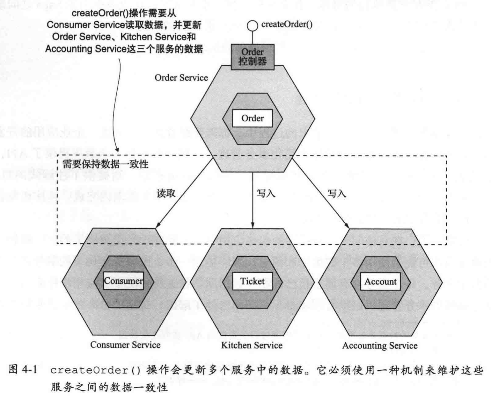

# 微服务架构设计模式

# 目录

<!-- TOC -->
- [第4章 使用Saga管理事务](#第4章-使用Saga管理事务)
- [第5章 微服务架构中的业务逻辑设计](#第5章-微服务架构中的业务逻辑设计)
- [第6章 使用事件溯源开发业务逻辑](#第6章-使用事件溯源开发业务逻辑)
- [参考](#参考)
<!-- /TOC -->

# 第4章-使用Saga管理事务

本章导读

- 为什么分布式事务不适合现代应用程序
- 使用 Saga 模式维护微服务架构的数据一致性
- 使用协同和编排两种方式协调 Saga
- 采用对策来解决缺乏隔离的问题

## 4.1-微服务架构下的事务管理

## 4.2-Saga的协调模式

## 4.3-解决隔离问题

## 4.4-代码示例
略

# 第5章-微服务架构中的业务逻辑设计

## 5.1-业务逻辑组织模式

## 5.2-使用聚合模式设计领域模型

## 5.3-发布领域事件

## 5.4-代码示例
略

# 第6章-使用事件溯源开发业务逻辑

## 6.1-使用事件溯源开发业务逻辑概述

## 6.2-实现事件存储

## 6.3-同时使用Saga和事件溯源

# 参考
